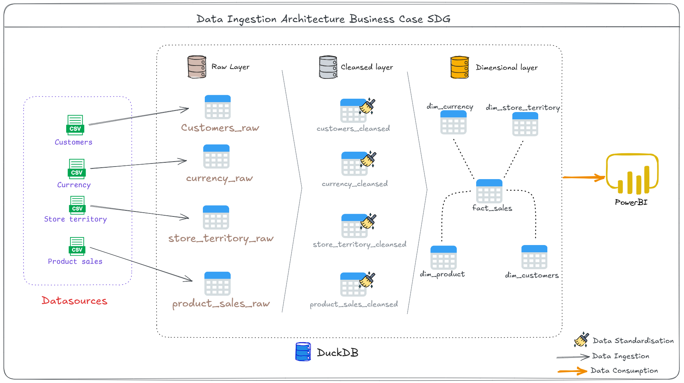

#  SDG Business Case Solution

This solution transforms raw, denormalized flat files into a optimized Star Schema tailored for Power BI consumption, adhering data engineering standards.

---

## Pipeline Architecture Overview

The pipeline follows a modular Medallion Architecture (Bronze → Silver → Gold) to isolate data ingestion, quality cleaning, and dimensional modeling layers. 

The visual architecture of the end-to-end data flow is shown below:

### Operational Layers

#### 1. Data ingestion (Bronze)
* Serve as an append-only landing zone that preserves data as raw as possible.
* Google Drive is mounted into the Google Colab. Raw CSV files (`Customer.csv`, `Currency.csv`, `Store_Territory.csv`) are ingested directly into individual DuckDB tables.
* To handle time-sliced data efficiently, product sales files (`Product_Sales_20210701.csv` and `Product_Sales_20221231.csv`) are  unified upon ingestion via an optimized single-scan SQL wildcard read (`Product_Sales_*.csv`).

#### 2. Quality, Cleaning and Transformation (Silver)
The Silver layer use the following metadata-driven functions:

* **`handle_duplicate_columns`** Scans the DataFrame for columns auto-suffixed with '_1', Compares data contents with the original base column, if contents match exactly, the redundant column is dropped. 
*Exception Handling* :  Analysis of the raw tables shows that `EmployeeKey` columns were 100% redundant with `StoreManager` and `SalesTerritoryManager`, which already contained the numerical employee foreign keys. The pipeline explicitly purges these redundant keys.
* **`remove_duplicates`:** Drops records sharing duplicated Primary Keys. For table Customers applies window sequences to keep the latest record based on a modification date (`modified_date`).
* **`handle_missing_values`:** Substitute empty elements. Categorical text nulls are replaced with a `'Unknown'` string flag and for numeric columns replaced with "0.0" decimal number to preserve visualization rendering in dashboards, preventing charts from breaking due to blank values. 
* **`cast_data_types`:** Standardizes formats across all tables by explicitly transforming IDs into `int`, monetary metrics into `float`/`double`, and string timestamps into standard `date` formats using a dictionary with expected schema for each table.

**`cleaning_process`** 
This is the Orchestration process to apply normalization methods to dataframes and create cleansed layer, is mandatory to extract data from raw tables into dataframes to apply standardisation methods, then the cleansed tables are created based on processed dataframes.

#### 3. Dimensional Modeling (Gold)
The Gold layer contains the final Star Schema optimized.
* According to visual requirements of the business specification, all primary and foreign keys are explicitly aliased with an `ID_` prefix (e.g., `ID_Customer`, `ID_Store`, `ID_Product`, `ID_Currency`). This guarantees zero friction during data model mapping in Power BI.
* The denormalized product catalog attributes embedded within the raw product sales files are isolated and extracted into a clean, normalized `dim_product` dimension, reducing fact table storage width.
* To empower business decision-making, the pipeline injects three analytical metrics  inside `fact_sales`:
    * `NetQuantity`: `SalesQuantity - ReturnQuantity` Actual quantity of products sold in each sale.
    * `NetProfit`: `SalesAmount - TotalCost` Actual profit after deducting the total cost .
    * `ProfitMargin`: `NetProfit / SalesAmount` ratio of Net Profit to total Sales Amount.

 **Architectural Attributes Decisions:**  

* Excluding columns that serve zero business reporting purpose reduces asset clutter, decreases in-memory footprint, and mitigates attribute fatigue for BI designers.
 *  Even though customer data might not be mapped in the dashboard view, the `dim_customer` dimension is fully built and deployed, this future-proofs the infrastructure.

---

## How to Run the Pipeline

1. Upload the raw files into your Google Drive under a directory named `DE Sandbox`.
2. Open the accompanying `DE Sandbox.ipynb` in Google Colab.
3. Run the **Initial Setup** cell to connect Drive and instantiate the DuckDB.
4. Execute the pipeline components sequentially. Check console logs to monitor table volumes and automated schema resolutions in real-time.
